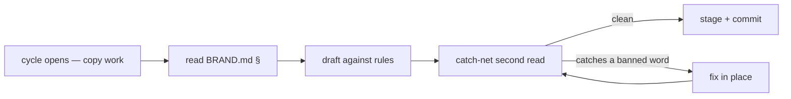

## WHAT

`BRAND.md` (in the studio repo) is the canonical handbook for everything the suite says, names, and looks like. It's referenced inside every cycle that touches copy, naming, hero patterns, footers, changelog entries, or visual register. The handbook is dense, opinionated, and load-bearing — it's the cheapest mechanism the operator has for keeping voice consistent across five products without re-deciding the same questions every cycle.

The voice is named explicitly: **Stark+Jobs**. Tony Stark's confidence, Steve Jobs's restraint. Declarative. Plain English. Verbs over nouns. Concrete over abstract. No exclamation marks anywhere — confidence doesn't shout.

## WHO

Ethan owns BRAND.md outright. Every other contributor (Claude in any role, Codex, future hires) reads it before writing copy and references it when pushing back on copy that violates it. The handbook is updated only by Ethan, deliberately — when the brand changes, it's a decision, not a drift.

## WHERE

- `~/Projects/personal/studio/BRAND.md` — the handbook. Section structure:
  - §1 The suite (four products under one umbrella; refusals; what doesn't get added)
  - §2 Operating thesis (the 80% audience archetypes, what fails them, the moat)
  - §3 Voice — Stark+Jobs (cadence, banned words, cadence words, emotional intelligence)
  - §4 Naming conventions (product naming, umbrella naming, email, URLs)
  - §5 Visual register (palette, type, motion, banned visuals)
  - §6 Page-level conventions (hero pattern, CTA verbs, footer pattern, changelog convention)
  - §7 Audience accents (per-archetype tonal shifts)
  - §8 Operating constraints
  - §9 How to use this document
- `src/app/globals.css` — the visual register tokens (`--paper`, `--ink`, `--accent: #4f46e5`, tracking variables). Codified version of §5.
- `src/components/wordmark/` — the `<Wordmark>` component, gestures encoded per §1 / §4.
- `src/app/brand/` — `/brand` public asset hub (the brand is *available*, not just enforced).

## HOW

The enforcement is *operational*, not technical. There's no linter checking banned words. The catch-net is the cycle pattern:

1. **Cycle opens with copy or visual work.** Before drafting, read the relevant BRAND.md section (§3 for words, §5 for visuals, §6 for page patterns, §7 for audience accents).
2. **Draft against the rules.** Examples: hero patterns follow §6.1's three-line shape; CTAs use the verbs in §6.2; banned words in §3 are off-limits unless explicitly carved out for a security/docs page.
3. **Cross-check before commit.** If the cycle is non-trivial (a new page, a hero rewrite, a naming decision), the catch-net is a second read against BRAND.md before staging. Most cycles catch one or two banned words on this pass.
4. **The locked H1 across the suite is "Cut through the noise."** — the wedding-vow line. Never changed without a decision recorded in §1 or §6.
5. **Refusals stay refusals.** §1 lists what doesn't get built (no team tier, no private workspaces, no comment threading, no public directory). When a cycle proposes one of these, the catch-net is: name the refusal, then decide whether *this* cycle is the one that overturns it. Almost always: no.

### The most common catches

- **AI-marketing register** (§3 banned words). "AI-powered", "intelligent", "smart", "autonomous", "predicts". The suite is plainly-named software; the AI is plumbing, not personality.
- **PM jargon.** "Sprint", "epic", "stakeholder", "MVP" in body copy. Use "cycle", "feature", "operator", "first version".
- **Tech jargon on user-facing pages** (§3). "API", "webhook", "deploy" don't appear outside `/security` and `/docs`. Use "connect", "works with", "real-time".
- **3-adjective trios.** "Fast, beautiful, intuitive" is a stock-marketing tell. One adjective if any. Often zero.
- **Wordmark drift.** "Signal" (no period, no studio) collides with Signal Messenger and gets stripped on every catch. The wordmark is always **`signal studio.`** with the period (per §4 and the wordmark component).

## WHEN — current state

- Handbook stable since 2026-05-12 (moved into studio repo from a previous shared location).
- §5 D01 (indigo `#4f46e5`) retired the antique gold `#c9a96a` on 2026-05-11. Gold survives only as a wordmark-period detail.
- Voice version: Stark+Jobs locked. Audience archetypes (§2.1) carry five named personas — wedding, trades, student, freelance, marketing — with public-coordinator and small-business-operator flagged in BRAND.md but not yet landed as audience pages.
- The /brand public asset hub at signalstudio.ie/brand is the externally-visible expression of the handbook (wordmarks, palette, type scale, voice rules, eighteen downloadable SVGs).
- S·26 (2026-05-14) added `loading="lazy" decoding="async"` to those eighteen images and stepped the wordmark + motion grids from a 1→5 jump to 2→3→5. CSS register, no copy or palette change. Handbook unaffected.

## WHY

Solo operators ship inconsistent voice across products because every cycle re-decides the small questions. Should this CTA say "Get started" or "Try it"? Should the hero be three lines or two? Is "AI-powered" OK if it's true? Without a handbook, every answer is fresh. With a handbook, the answer was decided once and the cycle stays cheap.

The handbook is the moat (§2.3 — "discipline, not feature"). Any competitor can copy a feature; very few can sustain a tonal discipline across five products over twelve months. The discipline is what makes the suite feel like one thing instead of five.

The banned words list is the most actively-applied piece. It's blunt, and that's deliberate — the alternative is a vibes-based "this feels off" judgment that's slower to invoke and harder to defend. Naming a word as banned makes the catch instant.

The refusal list (§1) is the strategic anchor. The temptation in any product is to add — features, tiers, integrations, surfaces. The handbook explicitly says "no" to the things that would make the suite less itself. That refusal is brand work as much as it is product work, and BRAND.md is where it lives.

## Reverification trail

- 2026-05-14 (S·32) — BRAND.md §6.5 grew two new paragraphs: "Engineering log vs dispatch (clarified 2026-05-14)" establishes a two-artifact discipline, and "Banned in the dispatch (extended)" enumerates engineering-internal references (file paths, function names, type names, library names, hex codes, anything in backticks) that the dispatch must never reach for. Catch-net role unchanged — this is an *addition* to the rules BRAND.md enforces, not a modification of the enforcement mechanism. Voice, banned words, refusal list, and visual register sections untouched.
- 2026-05-14 (c044f50) — BRAND.md §6.5 cycle-code definition gained a preflight rule (`git log --oneline -20 | grep -oE '[STRAN]·[0-9]+'`) for catching parallel-session collisions before they ship. Addition to the convention, not a modification — the catch-net still holds for voice and visual rules.
