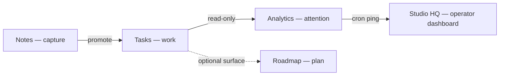

## WHAT

Four products, each named for the job they do:

- **Notes** — the capture surface; ideas land here before they're work.
- **Tasks** — the live workspace where work happens.
- **Timeline** — the public-facing planning surface, lighter than a project tool.
- **Signal** — the daily attention layer that reads Tasks data and surfaces three things worth noticing.

The four products share one design system (see [[brand-enforcement]] and the suite design system v1 shipped 2026-05-13), one pricing surface (see [[pricing-and-entitlements]]), and a small number of explicit cross-product flows.

## WHO

Ethan owns every product. Each lives in its own repo under `~/Projects/personal/`. No external operators. The four products are the cardinality limit the umbrella refuses to break (see [[signal-studio-umbrella]]).

## WHERE

- **Tasks** — `~/Projects/personal/tasks/`. Live at `tasks.signalstudio.ie`. Persistence on Turso since 2026-05-08.
- **Timeline** — `~/Projects/personal/roadmap/`. Live at `roadmap.signalstudio.ie` (and `roadmap-ebon-eight.vercel.app`). Phases 1–5 shipped 2026-05-09.
- **Signal** — `~/Projects/personal/analytics/`. Live at `analytics.signalstudio.ie`. End-to-end pipeline shipped 2026-05-13.
- **Notes** — `~/Projects/personal/notes/`. Live at `notes.signalstudio.ie`. Cross-repo Notes→Tasks extract shipped Cycle 9.4b.
- **Studio (umbrella)** — `~/Projects/personal/studio/`. Live at `signalstudio.ie`. The umbrella site, brand hub, pricing, HQ.

## HOW

The four products run as **autonomous units** that interact through three explicit hand-offs and one shared layer.

### The three hand-offs

1. **Notes → Tasks** (promote). User writes a note, promotes it into Tasks via Notes's "send to tasks" action. One-way; Notes never holds a Tasks write token. Implemented as authed HTTP POST (see [[log-cycle-cross-repo-writer]]).
2. **Tasks → Signal** (read). Signal reads the Tasks Turso DB via a scoped read-only token (write attempts blocked at the Turso layer). Tags in Tasks map to projects in Signal (see [[turso-databases-and-reads]]).
3. **Signal → Studio** (cron staleness). Signal's daily cron pings Studio after each run so HQ knows the engine fired. Studio's `cron_runs` table is the source of truth for "did the daily briefing job run today" (see [[log-cycle-cross-repo-writer]]).

### The one shared layer

- **Pricing and entitlements.** Every product reads from the shared `signal-entitlements` Turso DB via the copy-pasted `entitlements-shared` module (see [[pricing-and-entitlements]]). Tasks owns the Stripe webhook; Studio owns the admin grant surfaces; every product reads.
- **The suite switcher.** When signed in, every authed surface mounts the canonical `SuiteSwitcher` — an always-visible four-product pill row (`src/components/.../suite-switcher-pills.tsx`, copied byte-identical into all five repos; only the `current` prop differs). It carries the umbrella anchor once, the dot-morph jump, hover-prefetch and origin preconnect, so the four subdomains feel like one surface (perceived continuity, not a true SPA). The older click-to-open `SuiteLauncher` popover is retained only where a pill row does not fit or belong: the unauthed marketing nav, the narrow Tasks sidebar, and the public Timeline shared-plan header. Canonical spec: BRAND/DESIGN.md §14 (amended 2026-05-19, S·63).

### Boundaries the products *don't* cross

- Tasks doesn't capture; Notes does.
- Notes doesn't schedule or assign; Tasks does.
- Signal doesn't edit; it reads and renders.
- Timeline doesn't auth users into private workspaces; it's public-facing by design.
- Studio doesn't host product features; it hosts brand, pricing, and HQ.

These boundaries are the discipline that lets each product stay small. They get re-tested every cycle that proposes a cross-boundary feature.

## WHEN — current state

- All four products + the umbrella are live on Vercel as of 2026-05-14.
- Suite design system v1 unified visual register across all five surfaces 2026-05-13.
- Entitlements sprint closed 2026-05-14 — every product gates against the shared payments DB.
- Two cross-repo writers shipped (notes→tasks promote, signal→studio cron-ping).
- One read-only cross-product flow shipped (Tasks→Signal).
- No new product additions planned. Refusal list (see [[signal-studio-umbrella]]) keeps cardinality at four.

## WHY

The cheapest version of "ship a productivity suite" is one giant product with twelve features. Rejected: every feature pulls the product toward feature parity with every other productivity tool, and the result is undifferentiated.

The expensive version is one product per workflow, each genuinely small and good at its one job. That's what the suite is. The cost is the cross-product friction (a user has to know that capture is Notes and work is Tasks). The benefit is that each product can be world-class at its one thing without the design tax of being world-class at everything.

The three hand-offs are deliberate and explicit, not implicit. A user has to *promote* a note into a task. A user has to know Signal reads from Tasks. These visible boundaries are part of the product education, not friction to be optimized away — the boundaries are what teach the user that the suite is a system, not one app split into four tabs.

The shared payments layer is the only thing that has to be perfectly synchronized across products. Everything else can drift slightly (a Timeline update doesn't break Tasks; a Notes outage doesn't break Signal) and the suite still functions. Entitlements drift would be visible to paying customers within seconds and undermines the suite's commercial integrity, so it gets the single shared DB.

## Reverification trail

- 2026-05-16 (atlas re-verify) — `references[]` corrected: the non-existent `src/components/wordmark/` path replaced with the real `src/components/brand/wordmark.tsx`. System shape re-verified against BRAND.md §1 and the cross-flow descriptions and is unchanged — four products (Tasks/Timeline/Signal/Notes) under one umbrella, three explicit hand-offs (Notes→Tasks promote, Tasks→Signal read, Signal→Studio cron-ping), one shared payments layer. No body prose drift; the canonical gesture vocabulary is broadcast/pulse/sweep/tick/caret.
- 2026-05-14 (S·32) — BRAND.md §6.5 grew the engineering-log / dispatch separation rules. Five-product cardinality, three-handoff structure, and the shared-payments-as-the-only-tight-coupling reading are unaffected. The dispatch convention change is about how shipped work is *narrated* across the suite, not about how the suite is *shaped*.
- 2026-05-14 (c044f50) — BRAND.md §6.5 cycle-code preflight rule landed. System-shape claims here are unaffected.
- 2026-05-26 (S·68) — BRAND.md touched by S·68 (§6.6 operating vocabulary committed in the same batch). Re-verified BRAND.md §1 (four-product cardinality refusal), the three-handoff structure (Notes→Tasks promote, Tasks→Signal read, Signal→Studio cron-ping), and the shared-payments-as-the-only-tight-coupling reading — all unchanged. The `SuiteSwitcher` pills (canonical four-product row, spec DESIGN.md §14 amended S·63 2026-05-19) are the current cross-product navigation primitive; the `SuiteLauncher` popover is retained only in the three named exception surfaces. `/venues` page rebuilt (S·68) adds a venue coordinator view concept (coming for founding venues) — this is Studio-side marketing, not a product boundary change. Five-product cardinality remains: Tasks/Timeline/Signal/Notes + Studio umbrella. No cross-boundary drift detected.
