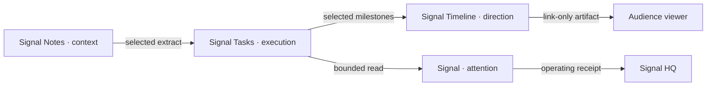

## WHAT

Signal Studio has four product modules:

- **Signal Notes** captures context.
- **Signal Tasks** owns execution.
- **Signal Timeline** publishes direction.
- **Signal** identifies what needs attention.

They share one authenticated runtime at `app.signalstudio.ie`, one account session, one operating shell, one design system, and one commercial relationship. They do not share one undifferentiated product job.

## WHO

Ethan owns the umbrella, unified app, product modules, data stores, and release decisions. A Workspace Member works inside the authenticated shell. A Timeline audience viewer is outside Membership and receives read-only access to one publication by possessing its unguessable link.

## WHERE

- **Unified app** — `app.signalstudio.ie`, served from the Tasks repository.
- **Signal Tasks** — `/app/work`.
- **Signal Timeline** — `/app/plan`.
- **Signal Notes** — `/app/notes`.
- **Signal** — `/app/brief`.
- **Standalone Timeline artifact** — `/s/<unguessable token>` once the selected Option D release completes.
- **Umbrella and HQ** — `signalstudio.ie` and the password-gated `/hq`.

`tasks.signalstudio.ie` remains a working app alias. The former Notes, Timeline, and Signal product domains route app traffic into the unified modules and marketing traffic to the umbrella. The Timeline-domain share-link compatibility edge is part of the Option D release and remains pending until deployment evidence exists.

## HOW

### One shell

The unified app handles the authenticated session, Workspace context, shared rail, settings, and cross-product navigation. Product modules keep their own routes, copy, read models, and boundaries.

The shell stops at the publication edge. A Timeline recipient sees the artifact without the black rail, account controls, or operating dashboard. The owner's phone preview uses the same renderer but does not become an audience view.

### Explicit handoffs

1. **Notes → Tasks:** a person selects an exact extract. Notes retains the source; Tasks owns the resulting work.
2. **Tasks → Timeline:** an owner selects the safe milestone projection. Private source records do not publish automatically.
3. **Tasks → Signal:** Signal reads bounded work state and returns grounded attention, never a second editing surface.
4. **Timeline → recipient:** a high-entropy, rotatable, revocable link grants read-only access to one frozen publication.

### Shared commercial layer

Entitlements remain a shared suite concern. Product-module consolidation did not authorize a second pricing model or per-module billing drift. See [[pricing-and-entitlements]].

## WHEN — current state

- The unified app and canonical `app.signalstudio.ie` domain were deployed in the 2026-07-21 to 2026-07-22 consolidation programme.
- Founder sign-in on the canonical domain was verified, and the prior product app domains now route into the unified modules.
- Signal Notes' durable notebook and exact Notes-to-Tasks handoff were released on 2026-07-18 and now live inside the unified app.
- The Signal Timeline owner module is deployed. Option D was selected on 2026-07-22; its standalone link-only artifact, qualified-view migration, compatibility edge, and live proof remain in the release pass.
- Planning Period and broad Audience Timeline claims remain gated by their separate production programme.

## WHY

Four separate sign-ins made the suite feel fragmented. One giant product would make each job less clear. The unified module architecture takes the useful middle path: one account and one place to work, with four deliberately narrow modes.

Signal Timeline proves why the distinction matters. Inside the shell, an owner curates and publishes. Outside the shell, a recipient sees one composed artifact, not the machinery used to make it. The product boundary creates clarity rather than adding navigation.

The four-product limit remains. New capability must strengthen context, execution, direction, or attention; it does not earn a fifth product name by being useful.
