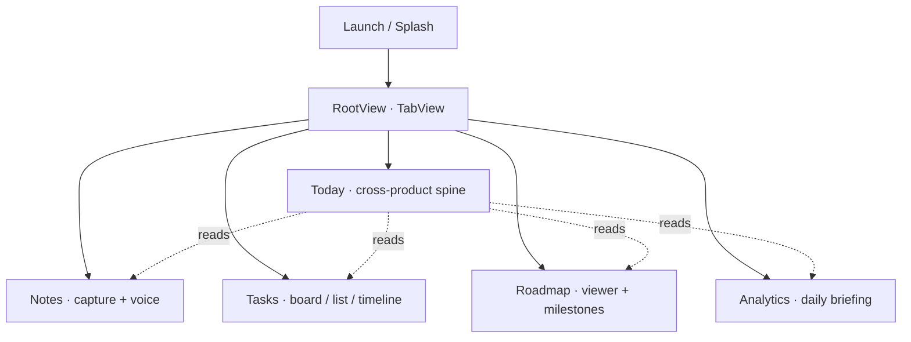

## WHAT

A native SwiftUI app that ports the Signal Studio suite to iPhone and iPad. Today screen aggregates across products (Tasks slices, Notes counts, Roadmap milestones, Analytics briefing). Four tabs underneath give product-specific surfaces. One shared session, native nav chrome, native APNs push, no IAP, no paid third-party services.

The architectural decision the suite app exists to defend: **App Review 4.2 (repackaged website)**. A four-tab webview wrapper would be the textbook 4.2 reject. The Today screen is the native layer that makes the app *more* app-like than a single-product wrapper, not less.

## WHO

Ethan owns the app outright. No iOS-team, no separate stakeholders. The agentic toolchain (Claude Code + Codex + Paul Hudson's swift-pro skills + XcodeBuildMCP) is the implementation surface. The operator handles signing, enrollment, screenshots, App Store metadata, anything that requires Apple-ID-gated GUI flows.

## WHERE

- `~/Projects/personal/signal-ios/` — the Xcode project (xcodegen-generated; `.xcodeproj` itself is gitignored). Schema in `project.yml`.
- `~/Projects/personal/signal-ios/SignalStudio/` — the Swift source root, organised by feature (App / Brand / Today / Notes / Tasks / Roadmap / Analytics / Settings / Loading / Empty / Onboarding / Fonts / Assets.xcassets / Preview Content).
- `~/Projects/personal/signal-ios/panel-reviews/` — gate-keeping reports for cycles 1 (baseline + final), 2 (final), 3 (status + final), and 5 (final). Cycle 4 ran as in-cycle remediation without a standalone report.
- `~/Projects/personal/signal-ios/IOS_PLAN.md` — original 13-screen plan, 9.5-gate rubric, mock-data strategy.
- `~/Projects/personal/signal-ios/FUNCTIONING_APP_PLAN.md` — Bucket A (operator-gated) and Bucket B (agent-shippable) split.
- `~/Projects/personal/signal-ios/README.md` — what's running on simulator today.
- `~/.claude/projects/-Users-ethanmcnamara/memory/project_ios_app_research_2026_05_19.md` — the strategic memo: feasibility scissors, scope rationale, gate logic.
- `~/Projects/personal/studio/docs/ios/` — submission artifact drafts (privacy labels, listing copy, data-flow doc — drafted in this cycle).

## HOW

The suite app is a Swift-native build, not a Capacitor wrapper. Three operating disciplines run the cycle:

1. **Panel-gated screens.** Every surface passes a three-panelist review (ux-director / creative-director / ux-tester) and ships only at ≥9.5 from all three. Cycles 1 + 2 final reports established the bar; Cycle 5 shipped Bucket B (real voice recording, stores, cross-product nav, accessibility, polish) at the same bar.
2. **No paid third-party services.** A locked refusal. The "$99 only" budget rule (Apple Developer Program is the only money) means no RevenueCat, no Mixpanel, no Sentry-iOS-paid-tier — anything that would introduce per-month commercial obligation. Free tools only (XcodeBuildMCP, native APNs, Resend free tier for email).
3. **Login-only commerce surface.** No IAP, no in-app pricing display, no purchase buttons. The app is sold via the web — the iOS shell respects §3.1.3(b) "reader app" carveout because no commerce surface exists inside the app. Avoids the 15-30% App Store cut and the platform-IAP build overhead.

### Refusal list (as of 2026-05-20)

- **No Capacitor remote-URL webview.** Architectural decision pre-Cycle-0; native SwiftUI throughout.
- **No four-separate-apps suite play.** One app, four product surfaces.
- **No IAP, no commerce inside the app.** §3.1.3(b) login-only companion.
- **No mascots, no SaaS-stock illustrations, no 3-adjective grids, no exclamation marks.** Per `BRAND.md §3` voice rules, enforced at panel time.
- **No paid third-party services.** Operator decision; the $99 Apple fee is the only cash spend.

## WHEN — current state (as of 2026-05-20)

**Front-end:**
- Cycles 0–5 shipped. Bucket B (13 batches) all closed: real voice recording (AVAudioRecorder + SFSpeechRecognizer), NotesStore + TasksStore + RoadmapMock + AnalyticsMock, SuiteCoordinator cross-product nav, accessibility helpers, pull-to-refresh + swipe-to-delete + context menus, Settings wiring, workspace switcher, Timeline + Updates + List views, polish (skeletons + form validation + date formatter), brand-voice sweep.
- 20 surfaces panel-verified at ≥9.5 from all three panelists through Cycle 2 final (the strict-bar moment). Cycles 3–4 added secondary screens that rode the established patterns. Cycle 5 added ~7 functional surfaces (Tasks Timeline, Roadmap Updates, Workspace switcher, About, AddTaskSheet, Today populated, List view) that were not individually paneled — token-budget call documented in `panel-reviews/cycle-5-final.md` §honest-dissent.
- Builds clean (0 warnings, 0 errors) across all 9 panel-driven iteration cycles.

**Web-side iOS-prep (this cycle, 2026-05-20):**
- PWA manifests + apple-touch-icons + maskable variants shipped across all 5 web repos (studio/tasks/roadmap/analytics/notes) — 3-director panel cleared at 9.5+ from each.
- `docs/ios/` submission artifacts drafted in the studio repo (privacy labels, data-flow doc, PrivacyInfo.xcprivacy template, App Store listing copy through signal-brand-voice).
- `ios/CLAUDE.md` scaffold added to give agentic-toolchain guard-rails for the next iOS cycle.

**Bucket A — operator-gated (cannot be agent-completed):**
- Live-device verification on a physical iPhone.
- Apple Developer Program enrollment ($99/year) — DUNS lookup is the long pole (7–10 business days).
- Code signing identities + provisioning profiles.
- TestFlight upload (operator's 2FA).
- App Store metadata submission (name, subtitle, keywords, description, age rating, privacy URL).
- App privacy disclosures (Apple's privacy nutrition label).
- Marketing screenshots + App Preview video.
- Backend wiring — production Turso + Clerk + Resend credentials.
- Push notification (APNs) certificates.
- Universal Links domain association (`apple-app-site-association` JSON).
- Real recorded audio on a physical microphone (simulator mic is the Mac's).
- A handful of brand-strategic copy decisions accumulated through cycles 1–5.

**Submission window:** post-Roadmap + Analytics quality, realistically after July 1.

## WHY

**The suite, not a beachhead, is the brand differentiator.** That's the operator-architecture call on 2026-05-19 — "the umbrella suite IS the brand differentiator; a lone Tasks app undercuts the whole Signal Studio positioning." Architect concession: optimising App Store mechanics over brand strategy was the wrong frame. The suite app exists to *be the umbrella in iOS form*, not to be the most-likely-to-pass-review product.

The 4.2 risk is what forces this to be native, not Capacitor. The agentic toolchain *could* ship a remote-URL webview in days — but App Review's textbook 4.2 reject is exactly that shape. The native Today screen + four native product surfaces is what makes the app substantively different from "the website in an app shell." That's the engineering cost the brand decision creates.

The no-IAP rule is commercial discipline. App Store IAP is 15–30% forever, and IAP wiring is agent-hard (Apple's StoreKit2 has Xcode-GUI-and-cert-gated capabilities). The §3.1.3(b) reader-app carveout requires no commerce surface inside the app — which the suite respects by design (sign-in only; pricing lives on the web).

The submission floor equals the weakest product in the suite. With Roadmap and Analytics at ~20% / ~50% completeness in early May (now both shipped to prod through the suite-wide elevation sprints), iOS launch is realistically post-July, gated specifically by sustained product quality through that window. The trade is recorded; it's not a July surprise.

## Reverification trail

- 2026-05-20 (this entry created) — written during the iOS-prep panel-cleared work cycle. Confirms current state against `signal-ios/` filesystem, `panel-reviews/cycle-5-final.md`, and the iOS app research memory. Status: `partial` (front-end built, Bucket A operator items pending). Pinned because it's gating the post-July product launch decision.
- 2026-05-20 (panel review of this entry) — corrected three drifts: (1) execRisk no longer self-contradicts (separating ship-state from quality risk); (2) "27+ surfaces panel-verified" softened to "20 surfaces strict-panel ≥9.5 through Cycle 2 + ~7 Cycle-5 surfaces not individually paneled"; (3) panel-reviews dir contents clarified (no cycle-4 standalone report — in-cycle remediation only); (4) WHY reordered to lead with the brand-decision pivot. Atlas structure unchanged.
