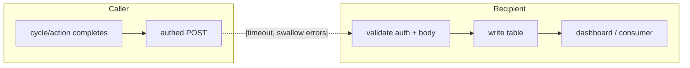

## WHAT

Some signals belong in one product's database but are useful to another. Cross-repo writers are the canonical pattern for moving those signals without sharing schemas, sharing tokens, or building a monorepo. The shape: caller fires an **authed HTTP POST**, with a **short timeout**, and **swallows errors**. The recipient owns the destination table, the validation, and the dashboard.

Two real instances ship today:

1. **Analytics → Studio** — cron staleness. Established Cycle 8.4.9 (2026-05-10ish). When the analytics daily cron finishes, it pings Studio so HQ knows the engine ran. Studio's `cron_runs` table is the source of truth for "did the briefing job actually fire today".
2. **Notes → Tasks** — note promote. Established Cycle 9.4b. When a user promotes a Note to a task, Notes POSTs to Tasks's API with the extracted content. Tasks owns the created row.

## WHO

Ethan owns both sides of every instance. There's no third-party caller, no webhook from outside the suite. Cross-repo writes always stay inside `~/Projects/personal/`.

## WHERE

**Analytics → Studio (cron staleness)**

- Caller: `~/Projects/personal/analytics/src/lib/ops/ping-studio.ts`. Reads `STUDIO_CRON_PING_URL` + `STUDIO_CRON_PING_SECRET` from env. POSTs JSON with a short fetch timeout.
- Receiver: `~/Projects/personal/studio/src/app/api/internal/cron-ping/route.ts`. Validates `Authorization: Bearer ${CRON_PING_SECRET}` (note the receiver-side env name differs from the caller-side — deliberate so a leaked one doesn't compromise both).
- Schema constraint: `CRON_RUN_SOURCES` in `studio/src/lib/db/schema.ts` enumerates accepted sources (`["analytics_daily"]` today). Adding a new caller means adding to this tuple — the receiver refuses unknown sources by design.
- Table: `cron_runs` in the studio Turso DB.

**Notes → Tasks (note promote)**

- Caller: `~/Projects/personal/notes/src/server/actions/notes.ts`. Reads `TASKS_API_URL` (defaults to `https://tasks.signalstudio.ie`) and `NOTES_TO_TASKS_SECRET` from env. Re-reads the freshest extract from the Notes DB before sending — the network call always carries creator-authored wording, never client-passed.
- Receiver: Tasks's HTTP API (route exists in the Tasks repo). Owns the destination task row.
- Configuration check: if `NOTES_TO_TASKS_SECRET` is missing, Notes throws explicitly rather than failing silently — the only path that *doesn't* swallow.

## HOW

The pattern has five invariants. Skip any of them and you've built fragile coupling.

1. **Caller posts JSON over HTTPS with `Authorization: Bearer ${SECRET}`.** No GETs. No query-string secrets. No mTLS — the secret is enough at this scale, scoped per-route.
2. **Caller uses a short timeout** (typically 2–5s, AbortController). The cycle in the caller's repo completes regardless of what the recipient does.
3. **Caller swallows non-2xx + network errors.** Logs locally if useful, never throws into the caller's success path. The exception is *configuration* errors (missing secret env var) — those throw loudly, so misconfiguration is visible.
4. **Receiver uses constant-time secret comparison** (`timingSafeEqual`) and a 401 fast-path. The receiver assumes hostile traffic — any non-suite caller probably means a leaked URL.
5. **Receiver owns the table.** The caller never knows the receiver's schema. The receiver maps the incoming JSON into whatever shape its dashboard needs, validates aggressively, and rejects unknown fields. Adding a new emit type to the receiver is a schema change in the *receiver's* repo, not the caller's.

## WHEN — current state

- Two instances live (Analytics→Studio cron-ping, Notes→Tasks promote).
- Pattern stable since Cycle 8.4.9. No deprecations.
- One frequent extension candidate: Roadmap → Studio (when a public workspace ships an item, ping HQ). Not built — no demand signal yet.
- Quiet gap: there's no shared utility module across repos. Each caller writes its own ~30-line fetcher. That's intentional (no shared dep, no monorepo); it's also a source of future drift — the two existing callers should look more alike than they do.

## WHY

The cheaper alternative was direct cross-DB writes via shared Turso tokens. Rejected: it would have required every product to know every other product's schema, and a bad migration anywhere would have broken everything that read it.

The expensive alternative was a message bus (Inngest, QStash, SNS). Rejected: too much weight for a five-product suite, and the bus would have become its own SPOF.

HTTP + bearer + recipient-owns-the-table is the cheapest reliable shape. It survives Notes being down (cron-ping skips and retries tomorrow). It survives Tasks being down (Notes throws on the user action, which is the right failure mode for an interactive promote). It scales linearly with new emit types — each one is a tuple addition in the receiver's `CRON_RUN_SOURCES` style enum.

The fire-and-forget shape is the most counter-intuitive piece. It feels wrong to swallow errors, but the alternative is making one product's cron failure into another product's cron failure — coupling exactly what the boundary is meant to decouple. The receiver's table *is* the dashboard for "did the caller actually run"; if rows stop arriving, the absence itself is the signal.
