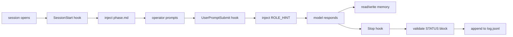

## WHAT

Three automated hooks plus a persistent memory layer plus a hand-written operating contract together form the runtime for every working session. The hooks fire deterministically; the memory accrues across sessions; the contract is the constitution.

The four pieces:

1. **`CLAUDE.md` (operating contract)** — the constitution. Names the 10 roles, the locked response format, the per-project phase vocabulary, the anti-patterns. Loaded into every session as a system reminder.
2. **`hooks/` (three deterministic injectors)** — SessionStart adds phase context to the first message; UserPromptSubmit adds a role hint to each user message; Stop validates the response format and appends to the log.
3. **`memory/` (auto-memory file system)** — one markdown file per fact, indexed by `MEMORY.md`. Persists user role, project context, feedback, references across sessions.
4. **`agents/` (10 role subagents)** — each role (senior-engineer, creative-director, strategy, etc.) is a separately-defined agent with its own voice and tool access, callable when the work spans roles.

## WHO

Ethan owns every piece. The hooks run on his local machine; the memory persists on his disk; the contract is his rule book. No external operators have read or write access.

## WHERE

- `~/.claude/CLAUDE.md` — the operating contract. Three rules: role routing, response format, phase awareness.
- `~/.claude/hooks/SessionStart` — injects the current phase from `~/.claude/state/phase.md` into the first message of every session.
- `~/.claude/hooks/UserPromptSubmit` — injects a `[ROLE_HINT: ...]` line into every user prompt based on keyword routing.
- `~/.claude/hooks/Stop` — validates the response ends with the locked STATUS block; appends a JSONL row to `~/.claude/state/log.jsonl`.
- `~/.claude/state/phase.md` — per-project phase line. Never edited silently — proposed in conversation, confirmed by operator, then saved.
- `~/.claude/state/log.jsonl` — append-only event log. One row per response. Searchable by date, project, phase.
- `~/.claude/projects/-Users-ethanmcnamara/memory/MEMORY.md` — the auto-memory index (one line per fact file).
- `~/.claude/projects/-Users-ethanmcnamara/memory/*.md` — individual memory files (user, feedback, project, reference types).
- `~/.claude/agents/` — 10 role subagent definitions.

## HOW



A working session runs through this shape every time:

1. **Session opens.** The SessionStart hook reads `phase.md` for the current project and injects it into the system context. The operator sees the active phase before typing anything.
2. **Operator sends a prompt.** The UserPromptSubmit hook reads the prompt, applies keyword routing (e.g., "fix this" → senior-engineer, "feels off" → creative-director), and injects `[ROLE_HINT: <role>]`.
3. **The model responds.** It picks the role (treating the hint as a hint, not a directive), responds in that role's voice, ends with the locked STATUS block.
4. **Session continues.** Memory gets read when relevant ("the user said X last week"); memory gets written when new facts arrive ("user prefers brief responses"). The 40+ memory files at the bottom of system context carry across sessions.
5. **Response ends.** The Stop hook validates the STATUS block is present. If missing, the response gets rejected and the model is asked to re-emit. The hook also writes a row to `log.jsonl`: project, role, phase, timestamp, ok flag.
6. **Project state changes.** If a phase advances, the operator confirms the proposed new phase line and `phase.md` is updated.

### The three role-routing signals

- **Operator's words.** "Fix this bug" → senior-engineer. "Look up the latest version" → researcher. "This feels off" → creative-director.
- **The hint from UserPromptSubmit.** Pattern-based keyword routing. Treated as a hint that the model can override silently.
- **The role's own description.** Each subagent has a description that names when to use it and when not to.

### The locked STATUS block format

Every response ends with:

```
── STATUS ───────────────────────────────────────────
Project : <name>
Role    : <one of the 10>
Phase   : <from phase.md>
Done    : <one line>
Risks   : <one line, or —>
Next    : <verb-first action>
─────────────────────────────────────────────────────
```

The format is non-negotiable. The Stop hook refuses responses that drift from this shape.

## WHEN — current state

- Operating contract stable since the role-routing table was finalized.
- Three hooks active across every session.
- 40+ memory files in the index as of 2026-05-14. The operator runs at memory-context-warm steady state — most sessions hit memory in their first response.
- The locked STATUS block has shipped every response across this and the prior several cycles without exception.
- 10 role subagents defined: senior-engineer, creative-director, ux-director, ux-tester, pm, program-manager, architect, qa, tech-writer, researcher, strategy (plus a few special-purpose ones).

## WHY

A solo operator running a five-product portfolio has an attention problem, not a coding problem. The constraint is: how to maintain consistency, focus, and quality across sessions that span days and projects.

Hooks solve the focus problem. SessionStart means the operator never wastes a session re-orienting to which project is active. UserPromptSubmit means the operator never wastes a sentence telling the model what role to play. Stop means the response shape never drifts.

Memory solves the consistency problem. Without it, every session starts from zero — the model would re-learn the user's role, the project's state, the user's preferences, the past cycle's decisions. With it, the model arrives pre-loaded with the operator's context and history.

The operating contract is the strategic layer. It names the trade-offs the operator already made — that responses should be terse, that the STATUS block ships every time, that anti-yes-man pushback is required. Codifying these as rules means they don't get re-litigated every session.

The whole stack is the operator's productivity multiplier. Without it, working with the model would be a series of disconnected conversations. With it, working with the model is a coherent collaboration that scales across the five products without the operator having to be the constant integration point.
