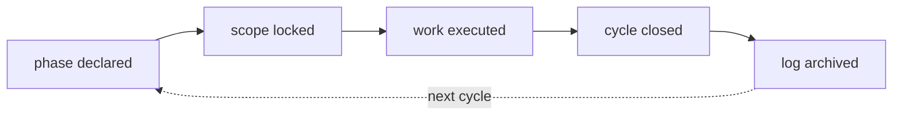

## WHAT

A Signal cycle is the working unit across all five products. One cycle opens with a phase line, runs through a sequence of small commits, and closes when the phase advances or completes. Plans 1–6 are the historical proof the loop works at scale — six plans, 24 cycles, all shipped between 2026-05-09 and 2026-05-14.

The cycle is not a sprint. It has no fixed cadence. It is shaped by the work, not by the calendar.

## WHO

Ethan owns every cycle. Claude (this role) executes inside cycles when invoked. No external operators.

## WHERE

- `~/.claude/state/phase.md` — the live phase line, per-project.
- `~/.claude/state/log.jsonl` — append-only event log written by the Stop hook.
- `~/.claude/hooks/` — SessionStart injects phase context; Stop appends to log and validates the STATUS block.
- `~/.claude/projects/-Users-ethanmcnamara/memory/` — auto-memory file system that persists facts across cycles.
- `CHANGELOG.md` inside each product repo — the public-facing voice version of what landed.

## HOW

The loop has five steps. Each one has a clear artifact.

1. **Phase declared.** A line lands in `.claude/state/phase.md` naming the cycle. Per-project vocabulary — Tasks uses "Cycle N", Luminary uses "Design Pass N", 1ERP uses "ITC/MC/UAT", Approvals Motion uses "Scene N of 6". Never imposed, always owned.
2. **Scope locked.** A short prose paragraph (in conversation or in a `docs/` file) names the WHAT, WHO, WHERE, and the *one* thing that ships. Bigger ideas split into multiple cycles.
3. **Work executed.** Commits land locally. Cross-repo work writes through `log-cycle.ts` so the umbrella sees activity. Tests and typecheck run before each commit. STATUS block emitted after each meaningful action.
4. **Cycle closed.** Phase advances or completes. CHANGELOG entry written in product voice. Memory updated with anything surprising — corrections, validated judgement calls, decisions that will matter in the next cycle.
5. **Log archived.** Stop hook auto-appends a JSONL row to `~/.claude/state/log.jsonl`. This is the cycle audit trail — searchable by date, project, phase.

Two invariants that hold across every cycle:

- **The STATUS block is non-negotiable.** Every response ends with it. The Stop hook will reject responses without it. The block is the only consistent shape across the loop.
- **`phase.md` is never edited silently.** Phase changes are proposed in-line, Ethan confirms, then the file changes. Drift here would break the rest of the loop.

## WHEN — current state

- 24 cycles shipped across Plans 1–6 between 2026-05-09 and 2026-05-14.
- Suite design-system v1 completed 2026-05-13 across all five products.
- Entitlements sprint (E-1 through E-8) is the next active sequence.
- Atlas v1 (this thing) is the current open cycle.

## WHY

Every product is a portfolio of small commitments. Sprints assume teams. This is a solo operator with a portfolio. The cycle replaces the sprint with something cheaper to start, cheaper to close, and cheaper to throw away. Drift is the enemy — so the phase line, the STATUS block, and the log are all forcing functions to keep the loop honest.

The plan cycle is the thing that lets one person ship five products without losing the thread.
