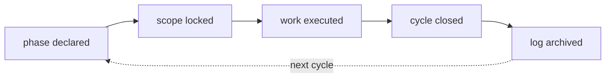

## WHAT

A Signal cycle is the working unit across all five products. One cycle opens with a phase line, runs through a sequence of small commits, and closes when the phase advances or completes. Plans 1–6 are the historical proof the loop works at scale — six plans, 24 cycles, all shipped between 2026-05-09 and 2026-05-14.

The cycle is not a sprint. It has no fixed cadence. It is shaped by the work, not by the calendar.

## WHO

Ethan owns every cycle. Claude (this role) executes inside cycles when invoked. No external operators.

## WHERE

- `~/.claude/state/phase.md` — the live phase line, per-project.
- `~/.claude/state/log.jsonl` — append-only event log written by the Stop hook.
- `~/.claude/hooks/` — SessionStart injects phase context; Stop appends to log and validates the STATUS block.
- `~/.claude/projects/-Users-ethanmcnamara/memory/` — auto-memory file system that persists facts across cycles.
- `CHANGELOG.md` inside each product repo — the public-facing voice version of what landed.

## HOW

The loop has five steps. Each one has a clear artifact.

1. **Phase declared.** A line lands in `.claude/state/phase.md` naming the cycle. Per-project vocabulary — Tasks uses "Cycle N", Luminary uses "Design Pass N", 1ERP uses "ITC/MC/UAT", Approvals Motion uses "Scene N of 6". Never imposed, always owned.
2. **Scope locked.** A short prose paragraph (in conversation or in a `docs/` file) names the WHAT, WHO, WHERE, and the *one* thing that ships. Bigger ideas split into multiple cycles.
3. **Work executed.** Commits land locally. Cross-repo work writes through `log-cycle.ts` so the umbrella sees activity. Tests and typecheck run before each commit. STATUS block emitted after each meaningful action.
4. **Cycle closed.** Phase advances or completes. CHANGELOG entry written in product voice. Memory updated with anything surprising — corrections, validated judgement calls, decisions that will matter in the next cycle.
5. **Log archived.** Stop hook auto-appends a JSONL row to `~/.claude/state/log.jsonl`. This is the cycle audit trail — searchable by date, project, phase.

Two invariants that hold across every cycle:

- **The STATUS block is non-negotiable.** Every response ends with it. The Stop hook will reject responses without it. The block is the only consistent shape across the loop.
- **`phase.md` is never edited silently.** Phase changes are proposed in-line, Ethan confirms, then the file changes. Drift here would break the rest of the loop.

## WHEN — current state

- 24 cycles shipped across Plans 1–6 between 2026-05-09 and 2026-05-14.
- Suite design-system v1 completed 2026-05-13 across all five products.
- Entitlements sprint (E-1 through E-8) is the next active sequence.
- Atlas v1 (this thing) is the current open cycle.
- S·26 (2026-05-14) added a CHANGELOG.md entry in the dispatch shape per BRAND.md §6.5 — conventional cycle close, no shape change to the loop itself.

## WHY

Every product is a portfolio of small commitments. Sprints assume teams. This is a solo operator with a portfolio. The cycle replaces the sprint with something cheaper to start, cheaper to close, and cheaper to throw away. Drift is the enemy — so the phase line, the STATUS block, and the log are all forcing functions to keep the loop honest.

The plan cycle is the thing that lets one person ship five products without losing the thread.

## Reverification trail

- 2026-05-14 (S·32) — CHANGELOG.md grew an S·32 dispatch-shape entry recording the engineering-log / dispatch separation. The plan-cycle loop itself is unchanged: phase.md still names the active cycle, STATUS blocks still close every turn, log.jsonl still records, the dispatch is still where shipped work surfaces out loud. What changed underneath is that the dispatch now reads from `content/dispatch/*.md` (operator-voice translations) instead of rendering the engineering log directly — two artifacts, two registers, one loop.
- 2026-05-15 (A·5) — Analytics CHANGELOG.md grew an A·5 dispatch entry for the code-review remediation. CHANGELOG-only drift; the dispatch is the loop working exactly as documented (step 4: cycle closed → entry in product voice). Re-verified, body unchanged.
- 2026-05-16 — CHANGELOG.md grew a run of dispatch entries (S·U4, S·23, S·24, S·37, S·25, S·38, S·39, S·40, S·40b, S·41) plus cross-repo R·U2/R·U3. Verified the shape against CLAUDE.md + BRAND.md §6.5: every entry holds `## YYYY-MM-DD · X·NN · verb · headline` then a bold impact-lead sentence then prose; the verb set in use (`ships` / `tightens` / `cuts` / `reads`, e.g. S·40b "reads" / S·37c "reads") is the documented `ships / tightens / cuts / holds / reads` vocabulary — no `holds` fired this batch, which is correct (silence is also brand; you don't write a dispatch just to write one). phase.md still names the active cycle and carries the entitlements/operator-action snapshot; the Stop hook still appends to log.jsonl; the STATUS block still closes every turn. CHANGELOG-only drift — the loop body is unchanged and accurate. Date-bump reverification only.
- 2026-05-16 (S·43/S·44) — CHANGELOG.md grew the S·43 atlas-reverify and S·44 cron-monitoring dispatch entries (program-health backlog run). Same shape, same verb vocabulary. CHANGELOG-only drift; the loop is operating exactly as documented (cycle closes → dispatch in product voice). Re-verified with the commit so the sidecar stays clear; loop body unchanged.
- 2026-05-16 (S·46) — CHANGELOG.md continued to grow through the program-health run (S·44/S·45/S·46). Re-verified in an atlas-only commit so the sidecar clears cleanly; the cycle loop is operating exactly as documented and the body is unchanged.
- 2026-05-16 (R·8 / A·12) — Cross-repo CHANGELOG drift: the Roadmap and Analytics CHANGELOGs each grew a footer-touch-target dispatch entry from the four-product S·26 mobile parity sweep (column footer links given a real touch height; Tasks already conformant, Notes has no marketing footer). The sibling pre-commit hooks flagged `plan-cycle` because `CHANGELOG.md` is a referenced file, but per the A.11 shared-sidecar contract only studio writes the sidecar — so this is the studio-side re-verify that clears it. Same dispatch shape, same verb vocabulary (`tightens`). CHANGELOG-only drift; the five-step loop body is unchanged — `phase.md` still names the cycle, the Stop hook still appends to `log.jsonl`, the STATUS block still closes every turn. Re-verified in an atlas-only commit so the sidecar clears cleanly (a referenced-file stage would re-flag).
- 2026-05-16 (S·49 follow-up) — While clearing the above, found the drift-trigger **silently inactive in studio**: `core.hooksPath` had been reset to `.git/hooks` (no `pre-commit` there) instead of the documented `.githooks`, so the first atlas-only commit (`10f46a4`) did not clear the sidecar — the hook never ran. Siblings (roadmap/analytics) were unaffected and still on `.githooks`, which is why their commits flagged drift normally. `core.hooksPath` restored to `.githooks` in studio; this commit is the atlas-only re-verify that the now-live hook actually clears. Mechanism-relevant: the failure mode is invisible — an unwired studio hook means drift silently never flags or clears, so the sidecar can read "clean" while being stale. Verify the hook fires, don't trust a quiet commit.
- 2026-05-16 (S·52 / S·52b) — CHANGELOG.md grew the S·52 dispatch entry for the Signal HQ PDF-export build (five one-pagers + the marketing-deck export, fast-forward-merged from an isolated worktree branch off `d140bc8`). The worktree commit flagged `plan-cycle` because `CHANGELOG.md` is a referenced file. The build adds new HQ surfaces but does not touch the cycle loop: `phase.md` still names the active cycle, the Stop hook still appends to `log.jsonl`, the STATUS block still closes every turn, and the dispatch is still where shipped work surfaces (S·52 is exactly step 4 — cycle closed → entry in product voice). CHANGELOG-only drift; loop body unchanged. Re-verified in an atlas-only commit so the now-live hook clears the sidecar cleanly. `core.hooksPath` confirmed still `.githooks` before relying on the clear (the S·49 silent-inactivity failure mode does recur — always check).
- 2026-05-16 (R·9) — CHANGELOG.md grew the R·9 dispatch entry for the Roadmap unification's mobile-H1 fix (the display-H1 clamp floors sheared the landing hero against its own `overflow-hidden` and ran a long workspace title off-axis at 390px; both floors lowered, desktop caps preserved, prod-verified by rendered bytes on roadmap.signalstudio.ie). The sibling (roadmap) pre-commit hook flagged `plan-cycle` because `CHANGELOG.md` is a referenced file — the same A.11 shared-sidecar re-flag every sibling dispatch causes; only studio writes the sidecar, so this is the studio-side re-verify that clears it. Same dispatch shape, same verb vocabulary (`tightens`), routed through the same five steps: `phase.md` named R·9 (operator-confirmed line, not silent), the cycle was logged via the Tasks-repo `log-cycle` cross-repo writer, the Stop hook still appends to `log.jsonl`, the STATUS block still closes every turn. CHANGELOG-only drift; the loop body is unchanged. Re-verified in an atlas-only commit so the live hook clears the sidecar cleanly (a referenced-file stage would re-flag). `core.hooksPath` confirmed `.githooks` before relying on the clear; committed on the parallel session's branch without a branch switch and with only this entry staged — the live HQ working tree (6 modified tracked files plus untracked `.agents/`/`motion-*`/`docs/strategy/`) was deliberately not touched.
- 2026-05-16 (T·65) — CHANGELOG.md grew the T·65 dispatch entry for the Tasks digest-cron fix: the 09:00 UTC digest had never actually run in prod (T·62 wired the HQ heartbeat but the route resolved its user via `getCurrentUser()`, which throws with no Clerk session; `CRON_SECRET` being unset had masked it behind the auth guard's 500). Resolved via `getCurrentUserOrNull()` + a no-user guard that records the heartbeat and returns cleanly. This entry re-flagged because `CHANGELOG.md` is a referenced file — the standard A.11 sibling re-flag. Re-verified: the cycle loop is unchanged and operating exactly as documented — `phase.md` named T·65 (operator-confirmed, not silent), the cycle was logged via the Tasks-repo `log-cycle` cross-repo writer (`tasks-c65`), the Stop hook still appends to `log.jsonl`, the STATUS block still closes every turn; the fix itself landed via an isolated worktree off `origin/main` so the parallel session's branch stayed clean — the cycle discipline is what made that safe. CHANGELOG-only drift; loop body unchanged. Atlas-only commit, `core.hooksPath` confirmed `.githooks`, no branch switch, only this entry staged. The co-flagged `turso-databases-and-reads` slug (re-flagged by parallel-session commit `efde4ee` touching `notes/drizzle/`) is deliberately left for its own owner — clearing another session's drift would be dishonest.
