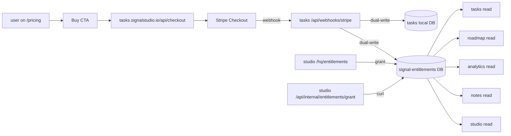

## WHAT

Pricing across the five products is unified at `signalstudio.ie/pricing`. Five tiers — `free`, `event`, `wedding`, `workspace`, `studio` — ranked 0–4. One shared `signal-entitlements` Turso DB carries every active grant. Every product reads from it via a copy-pasted `entitlements-shared` module — no monorepo, no shared package, just identical code in each repo. Tasks owns the Stripe wiring (webhook + checkout). Studio owns the admin surfaces (operator grants, HQ list, reconcile).

The entitlements sprint E-1 → E-8 closed this gap on 2026-05-14. Before the sprint, only Tasks enforced tiers; Roadmap, Analytics, and Notes were paid-tier-blind; Studio's `getEntitlement` was dead code. After the sprint, every product gates against the same DB.

## WHO

Ethan owns the pricing surface, the shared DB, the admin surfaces, and the tier vocabulary. Stripe handles payments; Vercel hosts the Webhook receiver. No third-party operators have grant authority.

## WHERE

- **`signalstudio.ie/pricing`** (studio repo, `src/app/pricing/`) — the unified pricing surface. Per-product `/pricing` paths 308 to this one.
- **Shared store** — `libsql://signal-entitlements-ethan387.aws-eu-west-1.turso.io`. Migrations in `drizzle-entitlements/`. Tables: `sponsors`, `license_codes`, `entitlements`, `redemptions`, `processed_webhooks`.
- **Copy-pasted resolver** — `src/lib/entitlements-shared/` in `tasks`, `roadmap`, `analytics`, `notes`. Exports `resolveEntitlement`, `resolveHighestTier`, `tierAtLeast`. The tier ranking (`free: 0` … `studio: 4`) lives in `tiers.ts` inside every repo's copy.
- **Studio's own variant** — `src/lib/entitlements/` and `src/lib/entitlements-db/` (different module names because studio is the writer side, not just a reader).
- **Tasks Stripe wiring** — `~/Projects/personal/tasks/src/app/api/checkout/` and `~/Projects/personal/tasks/src/app/api/webhooks/stripe/`. The webhook dual-writes to Tasks's local DB and to the shared store, idempotently via `processed_webhooks`.
- **Studio admin** — `src/app/hq/entitlements/` (UI, cookie-gated), `src/app/api/internal/entitlements/grant/` and `.../expire/` (curl path, Bearer `STUDIO_OPS_SECRET`). Off-Stripe grants carry `origin: studio-ops` or `origin: studio-hq` in metadata for audit grep.
- **Operator runbooks** — `docs/ENTITLEMENTS_OPS.md` (grant, expire, reconcile, audit, troubleshooting), `~/Projects/personal/tasks/docs/STRIPE_SETUP.md` (price IDs + webhook + envs).

## HOW

The resolve path (read side) is simple. The grant path (write side) is the part with invariants.

### Reading (every product, every request)

1. Server-side code calls `resolveEntitlement(userId)` from its local `entitlements-shared/reads.ts`.
2. The resolver queries the shared Turso DB for active entitlements (not expired, not refunded).
3. If multiple entitlements exist, `resolveHighestTier` picks the highest by rank.
4. The gate uses `tierAtLeast(currentTier, "workspace")` (or similar) to decide whether to allow the action.

### Granting via Stripe (the happy path)

1. User clicks CTA on `signalstudio.ie/pricing`. The CTA deep-links to `tasks.signalstudio.ie/api/checkout?tier=workspace` (or `event`, etc.).
2. Tasks's checkout route mints a Stripe Checkout session and redirects.
3. User pays. Stripe POSTs a webhook to Tasks's `/api/webhooks/stripe`.
4. The webhook validates the signature, looks up the price → tier mapping, and **dual-writes** the entitlement: one row in Tasks's local DB (for Tasks's own historical reasons) and one in the shared `signal-entitlements` DB (the canonical store every product reads).
5. The webhook records the Stripe event id in `processed_webhooks` so retries are idempotent.
6. Within seconds, every product's next `resolveEntitlement` call sees the new tier.

### Granting off-Stripe (operator path)

Two surfaces for support, pilot ops, and comp issuance:

- **HQ UI** at `/hq/entitlements` — cookie-gated; list, grant, expire from a form.
- **Internal API** at `/api/internal/entitlements/grant` and `/expire` — Bearer `STUDIO_OPS_SECRET`, curl-friendly, scriptable. Off-Stripe grants carry `origin: studio-ops` or `origin: studio-hq` in metadata so audit grep can tell paid-Stripe from operator-issued.

### Reconcile sweep (the safety net)

A daily reconcile sweep piggybacks on Tasks's existing digest cron. It walks Tasks's local entitlements and asks the shared writer to mirror anything missing, idempotently. `writeSharedEntitlement` retries transient errors with backoff. Drift between local and shared should be impossible in steady state; the sweep makes recovery from an outage automatic.

## WHEN — current state

- E-1 through E-8 shipped 2026-05-14. All five products enforce tiers against the shared DB.
- Stripe is sandbox-wired end-to-end. Live mode promotion is an operator action (see entitlements sprint operator action #1 in phase.md).
- A `?status=checkout-offline` banner renders on `/pricing` if Stripe envs aren't yet set in production, so the umbrella never silently grants free upgrades during the configuration window.
- 5 changelogs backfilled across the suite. 3 runbooks committed.
- The tier vocabulary is canonical — any new tier requires editing `TIER_RANK` in every repo's `entitlements-shared/tiers.ts`. The copy-paste cost is the deliberate price for not having a monorepo.
- S·26 (2026-05-14) made /pricing mobile-correct: Workspace promoted to top of stack ≤640px via `order-first md:order-none`, tier CTAs swap from inline-link to solid pill on mobile via a new `.pricing-tier-cta` class, comparison table `hidden md:block` (was 760w in 340w scroll parent). Tier model, prices, Stripe wiring, and entitlements DB all unchanged.
- A·5 (2026-05-15, Analytics code-review remediation) closed a gate bypass without touching the shared resolver or tier model: Analytics's `sendTestBriefingAction` (the "send a test now" button) had no entitlement check, so a free user could spam test sends every 60s and bypass the `workspace`-tier gate the cron enforces. It now calls the same `resolveEntitlement` + `tierAtLeast("workspace")` path. `tiers.ts` also gained regression-test coverage (`tiers.test.ts`) — the ranking that decides who pays was previously untested. Contract, vocabulary, and DB shape unchanged.
- T·50 (2026-05-15, code-review hardening) touched the Tasks read + webhook paths without changing the tier model, prices, or DB shape: (a) Tasks's `getEffectiveTier` now returns the **rank-max of the shared resolver and the local entitlements table**, not shared-first. The old shared-first short-circuit could silently downgrade a customer whose paid grant still lives only in Tasks's local DB during the E-3.2 writer cutover — rank-max is downgrade-proof and collapses back to a plain shared read once the local table empties. (b) The Stripe webhook's `processed_webhooks` dedup guard was repaired — `alreadyProcessed()` cast `db.run()` (a libSQL ResultSet) as a row array, so it always returned false and the dedup table never actually deduped; idempotency had been resting entirely on the `notes`-field compensator. The dual-write contract in the HOW section above is unchanged; this only fixed the guard that was supposed to make retries cheap.

## WHY

The cheapest version of "five products, one paywall" is a monorepo. Rejected: each product would have to coordinate releases, and a bad migration anywhere would break entitlement checks everywhere. The expensive version is a separate billing service. Rejected: too much weight, too much SPOF.

The shape that earned the build is the middle path — separate repos, separate local DBs, *one* shared store, copy-pasted resolver code. The duplication is the feature, not the cost: each repo can change its read shape without coordinating, and the resolver code is small enough (~80 lines) that drift between copies is rare and visible.

The dual-write from Stripe webhook is the load-bearing detail. Without it, Tasks would be a special citizen — the one product whose local DB is canonical — and the other four would be downstream readers. With it, the shared DB is canonical, Tasks is just the writer (because Stripe needs *some* product to host the webhook), and any product could host the writer if Tasks ever stops being the right host.

The five-tier vocabulary (free / event / wedding / workspace / studio) was chosen to match the audience archetypes in BRAND.md §2.1. Tiers that don't map to a real audience archetype don't get a name. The temptation to add a "team" tier was deliberately refused — see [[signal-studio-umbrella]] for the v1 refusal list.
