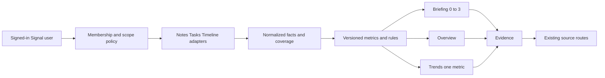

## WHAT

Signal progressive analytics is one read path with four depths. Briefing returns zero to three ranked observations. Overview assembles the useful current state for the selected workspace or project. Trends answers one metric question at a time. Evidence exposes the deterministic rule, comparison basis, freshness, coverage, and permitted Notes, Tasks, decisions, dependencies, milestones, and events that produced a claim.

It is not a fifth product and not a blank dashboard builder. Briefing remains the default. Customization is limited to hide, pin, reorder, and restore.

## WHO

Ethan owns the product decision, thresholds, release flag, and production promotion. Signal owns the normalized analytics domain and product UI. Signal Tasks, Signal Notes, and Signal Timeline remain owners of their canonical records and permissions.

## WHERE

- `~/Projects/personal/analytics/docs/PRODUCT.md` holds the user-facing product contract.
- `~/Projects/personal/analytics/docs/ADR-2026-07-13-SIGNAL-PROGRESSIVE-ANALYTICS.md` holds architecture, setup, release, and rollback decisions.
- `~/Projects/personal/analytics/src/lib/analytics/` holds UI-safe normalized contracts and response shapes (`contracts.ts`), timezone-safe dates (`time.ts`), scope filtering (`scope.ts`), deterministic metrics (`metrics.ts`), coverage-bounded time series (`trend-series.ts`), observation rules and ranking (`rules.ts`), and shareable context state (`url-state.ts`).
- `~/Projects/personal/analytics/src/server/analytics/` holds the centralized feature flag, query validation, live membership policy, provider adapters, response assembly, preferences, and private error handling. `service.ts` assembles the four response depths; `route.ts` applies their shared HTTP receipt.
- `~/Projects/personal/analytics/drizzle-signal/` is the isolated additive migration stream for per-user card preferences, prospective metric snapshots, snapshot-run state, and schema version. It stores no canonical source record or raw Note body.
- The versioned HTTP controllers live under `~/Projects/personal/analytics/src/app/api/signal-studio/v1/`.
- `~/Projects/personal/analytics/src/components/signal/` holds the scoped shell, controls, Briefing, Overview, Trends, Evidence drawer, chart, tables, coverage, freshness, and action components. The product views remain in the existing authenticated `~/Projects/personal/analytics/src/app/app/` shell.

## HOW

1. The existing Clerk session authenticates the request.
2. Query validation bounds workspace or project scope, period, timezone, filters, metric, breakdown, and pagination.
3. Policy revalidates canonical Tasks workspace membership. Project scope remains within that workspace. User scope is self-only in the first release.
4. Source adapters return normalized records plus provider coverage. Raw Note bodies and provider credentials never enter the analytics domain.
5. Deterministic metrics calculate results. Deterministic rules detect, combine, suppress, and rank candidates. Briefing takes no more than three.
6. Overview and Trends reuse the same facts and metric versions. Evidence returns only source records the current user can open.
7. Responses state calculation time, timezone, coverage, freshness, comparison basis, and rule version. Missing data never becomes a confident zero.
8. Tasks and Timeline source actions use their existing routes. Approved Note extracts remain read-only in Signal until Notes exposes a canonical record link; Signal does not duplicate editors.

Private responses stay out of shared caches in the first release. The feature gate is one server-side decision: `SIGNAL_ANALYTICS_V1_ENABLED`. Explicit false disables it; production is off when unset.

## WHEN — current state

- Direction accepted 2026-07-13.
- Product and architecture contracts are written.
- Normalized analytics contracts, timezone-safe date handling, scope filtering, URL state, deterministic metric calculators, observation rules, Tasks, Notes, and Timeline provider adapters, query validation, live workspace membership policy, private errors, same-origin preference protection, and the centralized feature gate are implemented on the Signal feature branch.
- Metric version is `signal-analytics-metrics@1.0.0`. Rule version is `signal-analytics-rules@1.0.0`.
- The full repository suite passes 271 of 271 tests on the July 16 rebased branch. TypeScript, both migration contracts, the design-system drift check, and the optimized production build also pass locally.
- The branch carries an isolated additive migration stream for `analytics_view_preferences`, `analytics_metric_snapshots`, `analytics_snapshot_runs`, and `analytics_schema_versions`. The migration contract rejects destructive statements and source-content fields.
- Analytics card preferences are included in Signal's existing account export and erasure paths. Aggregate snapshot tables exclude source titles, source identifiers, and raw Note content.
- The prospective snapshot writer and authenticated continuation route are implemented, bounded, idempotent, current-membership checked, oldest-first across day boundaries, and globally pruned after 400 days. Vercel is configured for one Hobby-compatible daily run at 02:30 UTC; authenticated manual invocations continue later batches during release proof or backfill. Neither path is deployed or proven against live provider data yet. Trends uses canonical events and completion timestamps first, supplements them with prospective snapshots only where scope and filters match, and never zero-fills time outside a provider's successfully queried history window.
- Five private, force-dynamic route files exist under `/api/signal-studio/v1`. Analytics reads return private no-store responses plus measured server timing. Preferences also reports its one known Signal-state query; the provider-backed reads do not publish an unmeasured query count.
- The scoped routes and product shell are integrated. The original local production-server browser pass covered the required views, healthy/provider-failure/insufficient-history states, 150-record Evidence pagination, context preservation, focus return, tablet, and 320px mobile with no console errors. That visual receipt predates the July 16 rebase and must be refreshed against the final preview before promotion.
- The production flag is off by default. No deployment or production exposure is part of this work.
- Notes can expose only approved extracts linked through promoted Tasks today; structured decisions and direct Note actions remain unsupported. Timeline movement depends on real stored activity and prior-date history. Both stay partial or unsupported when those canonical facts are absent.
- This Atlas entry is documentation-complete. The feature remains release-gated until live Clerk identities, inaccessible projects, real provider links, the deployed daily snapshot schedule, and production-like tenant isolation are proved.

## WHY

Briefing-only Signal answers the first question well but leaves a trust and navigation gap: the reader can see what needs attention without a consistent way to understand the wider state, compare it with recent work, or inspect every contributing record. A separate dashboard would solve the depth problem by breaking the product.

Progressive depth keeps the compact answer as the front door and makes every deeper layer earned. The same scope, metrics, coverage, and Evidence model powers all four views. That is the smallest architecture that can provide analytical depth without duplicating the suite or asking the user to become an analyst.
