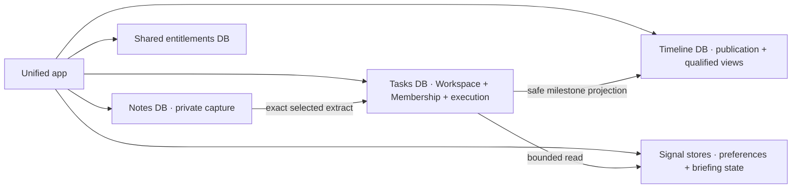

## WHAT

`app.signalstudio.ie` is one application runtime, not one all-purpose database. It connects server-side to bounded product stores through module-specific configuration.

The stores may be opened by one deployment, but permission and retention rules remain product-specific. No credential, raw token, or private record is sent to the browser merely because the modules share a process.

## WHO

Ethan owns every database, token, migration, backup, and production apply. The unified app is the runtime writer. Canonical product ledgers remain the source for their schema history until a recorded migration programme moves ownership.

## WHERE

- **Tasks store** — Workspace, Membership, execution data, and the unified app's primary runtime schema. Tasks remains the authorization authority.
- **Notes store** — private notes, extracts, and durable send state. Notes sends an exact user-approved payload into Tasks; Tasks owns the destination record.
- **Timeline store** — Timeline publication state. Its canonical migration history remains under `roadmap/drizzle/` while the serving code lives in `tasks/src/modules/timeline/`.
- **Signal stores** — briefing preferences and recorded attention state; bounded Tasks reads supply current work.
- **Shared entitlements store** — the canonical commercial relationship read by the unified app and administered through recorded Studio operations.

The 2026-07-22 Option D release adds publication-level qualified-view state through the Timeline ledger. The final migration identifier, production backup, isolated-copy dry run, apply receipt, and post-check remain pending until the release completes.

## HOW

1. **Name one canonical ledger.** A schema change lands in the repository named by the product contract. For Timeline publication changes, that is the Timeline `drizzle/` history.
2. **Update the serving mirror in the same release.** Runtime schema, queries, data-transfer objects, tests, export, and erasure paths in the unified app move with the canonical migration.
3. **Use additive migrations first.** Take a current backup, restore or copy it in isolation, dry-run the exact migration, run integrity and foreign-key checks, then apply to production and repeat the checks.
4. **Keep authorization at every read and write.** A shared process does not replace owner, Workspace, publication, or Membership checks.
5. **Keep cross-module payloads narrow.** Notes sends the selected extract. Timeline receives the published milestone allowlist. Signal reads bounded fields. Private source bodies do not flow by convenience.
6. **Keep audience metrics minimal.** A qualified Timeline view increments a publication aggregate after the visibility window and stores a short-lived hashed receipt for deduplication. It stores no raw share token, IP address, referrer, or user-agent.
7. **Delete and export deliberately.** Publication deletion and account erasure remove view receipts. Account export reports the aggregate where appropriate but omits receipt hashes.

## WHEN — current state

- The unified app was deployed from the Tasks repository during the 2026-07-21 to 2026-07-22 consolidation programme.
- Existing product database variables were staged in the unified app and recorded as connected before the canonical domain flip.
- `app.signalstudio.ie` is canonical; `tasks.signalstudio.ie` remains a working alias.
- The product database merge was deliberately not performed. Separate stores remain part of the privacy and rollback design.
- The Option D Timeline migration and production receipts are in progress. Do not describe qualified views as deployed until those receipts and the live owner/recipient journey exist.
- Planning Period production release remains a separate gated programme even though its architecture and modules are present.

## WHY

Moving product screens into one app solved the user-facing seam. Merging all data at the same time would have multiplied risk without improving that experience. Keeping bounded stores preserves staged migration, rollback, and privacy scope.

The cost is schema coordination. The unified app can break if a canonical ledger and its serving module drift. The answer is not to abandon the boundaries; it is to make migration ownership, backup, dry run, apply order, contract checks, and post-release evidence explicit every time.

Timeline qualified views show the standard. A useful owner metric needs one additive aggregate and a temporary deduplication receipt. It does not justify building a viewer identity store or retaining request exhaust.
