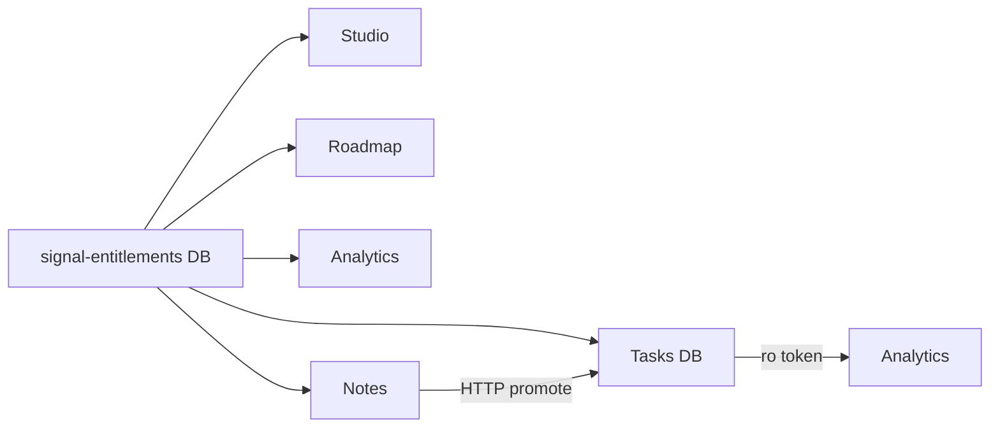

## WHAT

Five Turso libSQL databases serve the suite. Each product owns its own DB; one shared DB carries entitlements that every product reads. Cross-product reads use Turso's scoped tokens — when a product needs to read another's data, the writer mints a read-only token and the reader stores it in its own env. Writes never cross. Notes is the one exception, and it crosses by HTTP-to-Tasks, not by direct DB write.

## WHO

Ethan owns every database, every migration, every token. No external operators. Drizzle ORM is the single migration toolchain across all five repos.

## WHERE

- **Tasks DB** — `~/Projects/personal/tasks/drizzle/` migrations. Live workspace data, migrated to Turso on 2026-05-08.
- **Analytics DB** — `~/Projects/personal/analytics/drizzle/` migrations. User prefs, phrasing-rotation persistence, briefing audit.
- **Roadmap DB** — `~/Projects/personal/roadmap/drizzle/` migrations. Workspaces, items, activity log. `isPublic` + `shareToken` removed via `drizzle/0001_drop_isPublic_shareToken.sql` (applied 2026-05-12).
- **Notes DB** — `~/Projects/personal/notes/drizzle/` migrations. Notes content, extracts, capture surfaces.
- **signal-entitlements DB** — `drizzle-entitlements/` + `drizzle-entitlements.config.ts` (in studio repo). Shared canonical store: sponsors, license_codes, entitlements, redemptions, processed_webhooks. Every product reads it via a copy-pasted `entitlements-shared` module — no monorepo.
- **Cross-repo writer (Notes → Tasks)** — `notes/src/server/actions/notes.ts` posts to `TASKS_API_URL` with `NOTES_TO_TASKS_SECRET`. One-way only; the destination owns the task row.

## HOW

The pattern across the five is consistent.

1. **Migrations land in the owning product's `drizzle/` directory.** Run `pnpm db:generate` then `pnpm db:push` from that repo.
2. **Schemas live in `src/lib/db/schema.ts`** (or equivalent) per product. Never imported across repos — duplicated where needed.
3. **Connection uses `@libsql/client`** with `TURSO_DATABASE_URL` + `TURSO_AUTH_TOKEN` env vars per product. The auth token is full-write for the owning product.
4. **Cross-product reads** mint a scoped read-only token via the Turso CLI. The reader stores it under a different env var name (e.g., Analytics reads Tasks with a `TASKS_RO_TOKEN`) so it can't accidentally use the write token.
5. **Tag-as-project mapping** (Tasks → Analytics): Tasks has no `projects` table by design (per BRAND.md §2.2 — `tag-as-project` is canonical). Analytics maps `task.tags[]` to the `projectSlugs[]` field on `TaskRead` so it can group attention by project without forcing Tasks to add a column.
6. **Notes promote** (Notes → Tasks): Notes server action reads the freshest extract from its own DB, then POSTs to Tasks's HTTP API with the bearer secret. Tasks owns the destination row. The promote is irreversible from Notes's side — once sent, the Note keeps a "promoted" marker but doesn't track the resulting task.

## WHEN — current state

- 5 Turso DBs live as of 2026-05-14.
- Notes→Tasks promote shipped Cycle 9.4b.
- Tasks→Analytics read-only token live; carry-forward bug fixed Cycle 6.4.
- signal-entitlements shipped during the E-1→E-8 entitlements sprint (2026-05-14).
- Tasks `0005_workspace_id_backfill.sql` written 2026-05-15 (code-review T·50): backfills NULL `workspace_id` to the legacy workspace across seven tables (`tasks`, `comments`, `activities`, `notifications`, `entitlements`, `share_links`, `attachments`). Hand-applied via `turso db shell` per the repo's migration convention — operator owes the run. The NOT NULL + FK-with-cascade constraint rebuild is a separate operator-with-a-backup follow-up, documented inside that migration file, not auto-applied.
- The Tasks→Analytics read-only path was tightened 2026-05-15 (A·4): the cross-repo SQL now filters `parent_task_id IS NULL`, mirroring Tasks's own `getTasks`. Subtasks were leaking into the briefing engine as top-level signals. This is a reminder that the read query in `analytics/src/lib/briefing/tasks-db-source.ts` hand-mirrors Tasks's row-shape filters — a Tasks schema change to the parent/child model must be reflected here too.
- A·5 (2026-05-15, Analytics code-review remediation): Analytics gained `drizzle/0001_cadence_last_sent_index.sql` — a composite `(cadence, last_sent_at)` index on `user_preferences` so the daily cron's `WHERE cadence = ? AND (last_sent_at IS NULL OR last_sent_at < ?)` filter doesn't full-scan as the subscriber table grows. Same migration discipline as the rest of the suite (drizzle generate → hand-applied via Turso CLI; operator owes the prod run). The same cycle made the Tasks-read client lazy + self-healing on token rotation, and added a deterministic `ORDER BY t.id` before the `LIMIT 200` so truncation is stable. Schema of the read side unchanged.
- No live drift detection — when a schema changes, this entry has to be hand-updated. The v2 atlas drift-trigger is the planned mitigation; see `docs/ATLAS_DRIFT_TRIGGER.md`.

## WHY

Five products meant a choice between a shared schema (monorepo, single DB, shared migrations) and per-product autonomy (separate repos, separate DBs, scoped tokens). The autonomy choice was deliberate: each product can ship migrations without coordinating with the others, and a bad migration in Tasks can't take down Roadmap. The cost is that schema knowledge has to live somewhere outside the code — which is exactly what this entry is for.

The shared entitlements DB is the one exception, and it earns the exception. Pricing honesty across the suite required *one* source of truth for "who has paid for what". Trying to mirror that across five DBs would have created the divergence it's meant to prevent.

Notes-promote-by-HTTP rather than by direct write is a deliberate boundary: Notes never holds a Tasks write token. The HTTP boundary forces Tasks to validate everything coming in, which is the only safe shape for a content-producing product writing into a content-consuming product.
