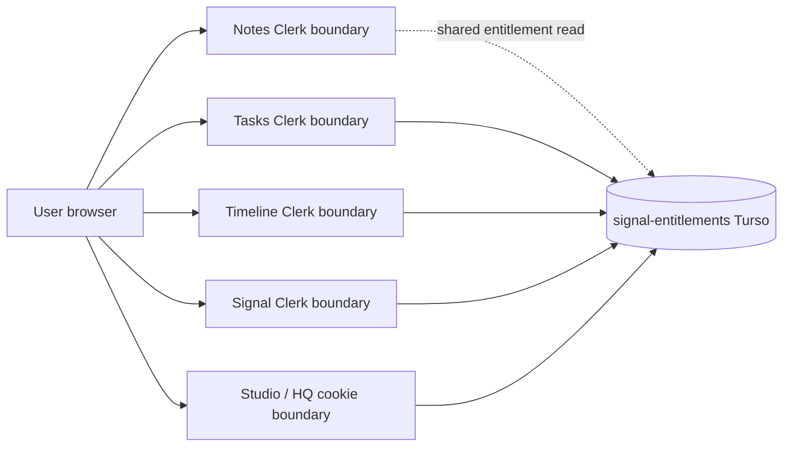
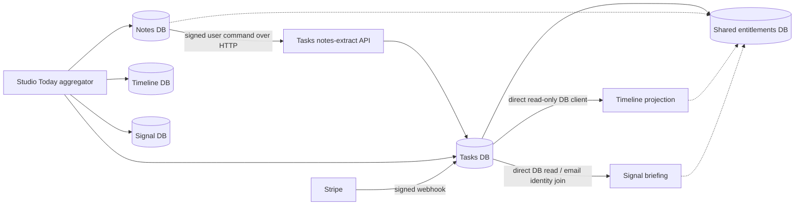
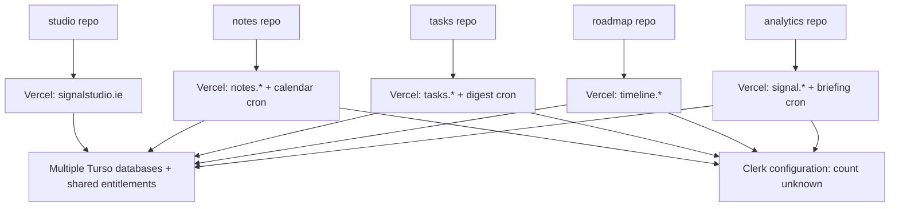

# Current-state architecture map

## Evidence status

- **Confirmed:** source/manifests/routes/schemas inspected locally; five production hosts returned HTTP 200 on 2026-07-11.
- **Strong inference:** coordinated changes require multiple repositories/builds; cross-domain switches reinitialize applications and likely auth.
- **Unknown:** provider-side Clerk instance count, Vercel mappings/settings, Turso token permissions/backups, production analytics/alert coverage.

## Repository and deployable inventory

| Surface | Purpose | Path | Runtime/build | Deploy/domain | Auth/session | Data/ownership | Integrations | Tests/ops | Major concerns |
|---|---|---|---|---|---|---|---|---|---|
| Signal Studio | Umbrella marketing, pricing, HQ, access operations | `studio/` | Next 16, React 19, pnpm, Vercel | `signalstudio.ie` | HQ password cookie; umbrella has no Clerk SDK; proxy reads `__session` | Studio/HQ Turso; shared entitlements; direct suite aggregation | Direct reads of four product DBs; Clerk webhook; internal entitlement APIs | 4 test files observed; no local GitHub workflow | HQ auth is separate; service-key impersonation risk; strategy drift |
| Signal Notes | Private capture and explicit promotion | `notes/` | Next 16, React 19, pnpm | `notes.signalstudio.ie` | Clerk; product-local proxy/onboarding | Notes/preferences/calendar; user-scoped, not shared workspace | Synchronous Notes→Tasks API; Tasks personalization API; shared entitlement reads | 3 test files; 06:00 calendar cron; Sentry | Body-trusted cross-product identity; context selection; private/suite workspace mismatch |
| Signal Tasks | Execution and collaborative workspace | `tasks/` | Next 16, React 19, pnpm | `tasks.signalstudio.ie` | Clerk; active-workspace cookie membership validated | Canonical execution data, workspaces/members, comments, notifications, billing webhook | Stripe and Clerk webhooks; Notes extract endpoint; Signal/Timeline readers | 12 test files; 09:00 digest cron; Sentry | Two confirmed tenant-integrity defects; public DTO hazard; `db:push --force` |
| Signal Timeline | Public direction and milestone presentation | `roadmap/` | Next 16, React 19, pnpm | `timeline.signalstudio.ie` | Clerk; owner/public model | Timeline projects/items/overlays; duplicated task-shaped records | Direct read of Tasks DB; shared entitlements | 8 test files; no `vercel.json`; Sentry dependency mismatch | Workspace model divergence; read-token capability unverified |
| Signal | Daily attention briefing | `analytics/` | Next 16, React 19, npm declaration | `signal.signalstudio.ie` | Clerk; separate onboarding/preferences | Briefing preferences, feedback, surfaced-item history | Direct read of Tasks DB; Resend; 06:00 cron | 13 test files; Vitest; Sentry; Upstash optional | Email-based identity join; overlapping workspace paths; cron/env reliability |
| Design foundation | Intended shared tokens/components | `ds-foundation/` | TypeScript package | Not a user deployment | None | Design contracts | Not consumed by product manifests | Build scripts only | Documentation ahead of adoption |

Framework evidence: each product manifest defines independent `next build`/`next start`; package versions have already drifted. Domain evidence is centralized in `studio/src/server/today/shape-native.ts:41-44` but also duplicated in per-product `product-urls.ts` files.

## Authentication map

Confirmed from `docs/SUITE.md:107-108`: all products have a suite switcher, but the shared auth seam remains owed. Studio assumes cross-subdomain `__session` behavior in `studio/src/proxy.ts:81-107`; this does not prove one Clerk application. Signal bridges Tasks identity by verified email in `analytics/src/lib/briefing/tasks-db-source.ts:11-18,68-90`, which is not an acceptable canonical authorization key.

## Data ownership map

| Entity | Current owner/source | Cross-product use | Finding |
|---|---|---|---|
| User identity | Clerk per product configuration; product-local user rows | Email/Clerk IDs exchanged | No proven suite subject mapping |
| Workspace/membership | Tasks has UUID + membership join; Timeline has slug/owner; Notes is user-scoped; Signal preference links a Tasks workspace | Switcher does not carry context | No canonical suite workspace model in implementation |
| Task | Tasks | Signal reads; Timeline projects milestones; Notes creates explicitly | Ownership is directionally correct; contracts are fragile |
| Note | Notes | Explicit extract only | Correct product boundary |
| Timeline item/milestone | Tasks owns milestone existence; Timeline owns presentation/overlay | Direct Tasks DB read | Good precedent, but direct coupling needs contract/telemetry |
| Signal/briefing | Signal | Reads Tasks; Studio aggregates | Derived read model is appropriate |
| Entitlement | Shared `signal-entitlements` Turso projection; Tasks Stripe webhook writes paid access | All apps read copied resolver/schema code | Correct central store, duplicated package and lifecycle work remains |
| Billing | Stripe events in Tasks | Shared entitlement projection | One writer is correct; provider setup and lifecycle completeness unverified |
| Templates | Studio-defined build-time shape; Tasks gallery | Slices synced/consumed | Build-time ownership is workable, drift checks needed |

## Integration and dependency map

- **Synchronous HTTP:** Notes extract and personalization calls.
- **Direct DB reads:** Signal→Tasks, Timeline→Tasks, Studio→all product stores.
- **Events/queues:** no general durable bus/outbox was found; `tasks/src/server/events.ts` is in-process.
- **UI-only integration:** identical suite switcher links to generic sibling `/app` and carries no workspace/project/object context.
- **Accidental coupling:** copied entitlements schemas/resolvers, copied switcher/shell/product URL registries, email identity joins, and structural copies of Tasks DB readers.

## Shared versus duplicated capabilities

The five `suite-switcher-pills.tsx` copies are byte-identical (SHA-256 prefix `5D9CBD22B813`, 9,143 bytes). Entitlement schema and tier files are also byte-identical across the four products; resolver copies have begun to drift. Design-system audit evidence reports roughly 1,040 hardcoded TSX hex values and no meaningful package consumption. Account menus, onboarding, settings, telemetry, CSP, rate limiting, and error handling vary by repository.

## Deployment and operations map

No `.github/workflows` were found in the five inspected repositories. Vercel may enforce checks externally, but that was not verifiable. Existing `.next` directories total hundreds of MB per app; these are build/cache footprints, not client bundle sizes and must not be treated as performance measurements.

## Live HTTP observation

On 2026-07-11, all five canonical hosts returned HTTP 200 over HTTPS with HSTS. Studio, Tasks, Timeline, and Signal returned `Content-Security-Policy-Report-Only`; Notes returned enforced CSP. Responses ranged from roughly 0.4–2.0 seconds in a single unscientific HEAD sample and are not a latency baseline.
