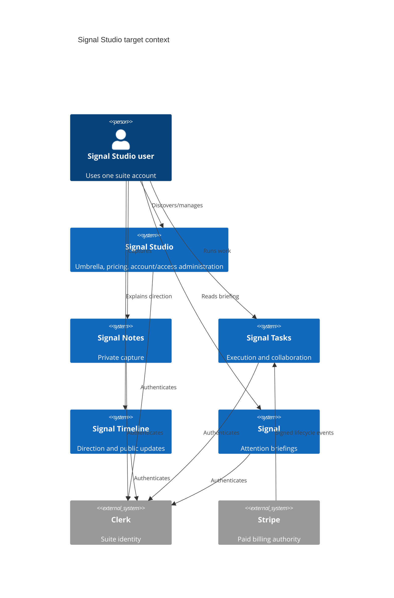
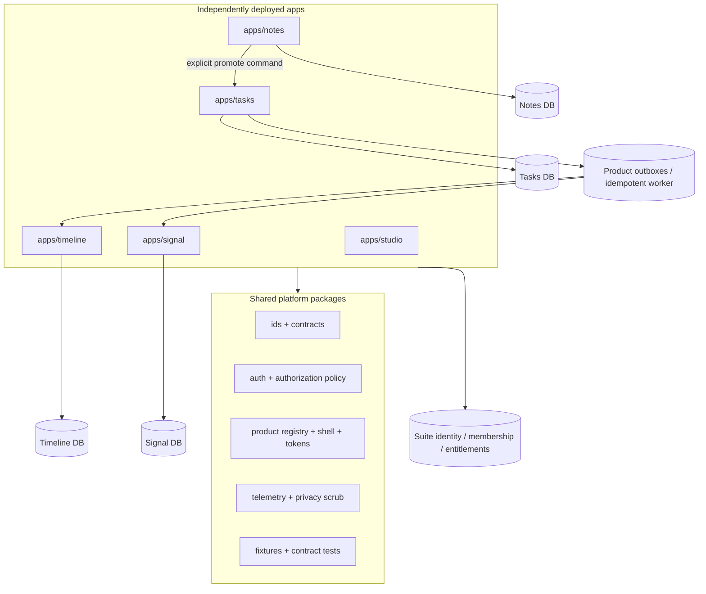
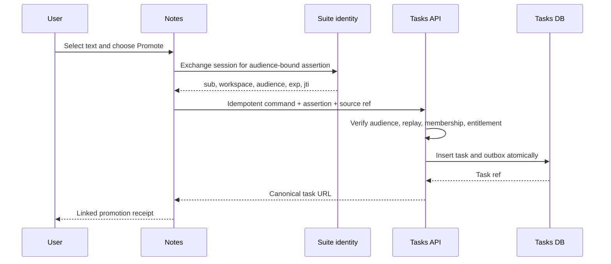

# Target architecture

## Decisions

| Dimension | Decision |
|---|---|
| Umbrella/product brand | Four endorsed products under Signal Studio |
| Names | Signal Notes, Signal Tasks, Signal Timeline, Signal; short labels in chrome |
| Domains | Retain existing subdomains; stable object URLs per owner product |
| Global navigation | Shared suite switcher plus context-aware resolver; product navigation remains local |
| Account/workspace | One suite account and canonical workspace/membership IDs; products project local needs |
| Identity provider | One Clerk application/custom domain/session if provider verification supports it; otherwise federated apps mapped to one immutable suite subject |
| Authorization | Server-side RBAC/relationship checks at every API/action/job plus DB constraints where possible |
| Entitlements | Shared user/workspace entitlement projection with product overlays; Stripe is paid billing authority |
| Repository | Option B now; Option C monorepo target |
| Runtime/deployments | Five independently deployable Next.js apps and domains |
| Shared frontend | Versioned tokens, shell primitives, identity entry, product registry, standard states |
| Data ownership | Product databases own domain entities; platform owns identity/membership/entitlement contracts |
| Internal APIs/events | Commands via authenticated APIs; queries via owned APIs/read models; DB outbox for durable propagation |
| Linking | Global typed object reference `{product,type,id,workspaceId,url}` with stable deep links |
| Search/notifications | Product-local before launch; shared read model only after usage evidence |
| Billing | One billing webhook/writer; workspace subscription with product-capable entitlements |
| Analytics/observability | Shared event names, privacy scrubber, request/subject/workspace correlation IDs, per-product dashboards |
| Testing | Unit + authorization matrix + contract + production-like cross-product journeys |
| Release/rollback | Affected-app CI, independent deploys, coordinated contract manifest, ≤10-minute rollback target |

## Context diagram



## Container diagram



## Proposed repository structure

```text
signal-studio/
  apps/
    studio/
    notes/
    tasks/
    timeline/
    signal/
  packages/
    product-registry/
    design-tokens/
    suite-shell/
    identity/
    tenancy/
    entitlements/
    object-links/
    telemetry/
    test-fixtures/
    config-eslint/
    config-typescript/
  contracts/
    events/
    internal-api/
  docs/adr/
  tooling/
```

Packages must be small and proven by duplication. Do not create a generic component warehouse or a “platform” service that owns product behavior.

## Canonical model

- **User:** immutable `suite_user_id`, linked to one or more provider identities; email is an attribute, never an authorization key.
- **Account:** login/profile/legal lifecycle for one person; initially 1:1 with User.
- **Workspace:** suite collaboration boundary with immutable ID and display slug.
- **Organization:** optional billing/admin grouping of workspaces; do not require for normal users.
- **Membership:** `(workspace_id, suite_user_id, role, status)` with invitation provenance and timestamps.
- **Roles:** `owner`, `admin`, `member`, `guest`; permissions are explicit capabilities, not frontend labels.
- **Entitlement:** subject (user/workspace/org), product scope, tier, source, validity, status, immutable provenance.
- **Subscription:** Stripe-backed billing contract referencing the entitled subject.
- **Invitation:** single-use, expiring, workspace-scoped, role-scoped, auditable.
- **Session:** provider session mapped server-side to suite subject; no body-supplied impersonation.
- **Service account:** named issuer, narrow audience/scope, rotatable credential, audit trail; never a fleet-wide user impersonation key.

## Authorization rules

Every command follows: authenticate subject → resolve suite subject → load membership/entitlement → authorize capability → scope query by tenant and object → mutate with `RETURNING` → write audit/outbox atomically. Background jobs repeat authorization against current membership; they do not trust stale event claims for access.

Database protections should enforce same-workspace parent/child relationships and uniqueness where SQLite permits. Public routes project allowlisted DTOs and never reuse internal domain objects.

## Cross-product object linking

```ts
type SuiteObjectRef = {
  version: 1;
  product: "notes" | "tasks" | "timeline" | "signal";
  type: string;
  id: string;
  workspaceId?: string;
  canonicalUrl: string;
  sourceRef?: SuiteObjectRef;
};
```

The switcher carries `{workspaceId, projectId?, objectRef?, returnUrl}` to a server-side resolver. If a sibling has no equivalent context, it opens that product’s workspace home and offers a return link. Never leak private object identifiers into public URLs without an opaque share token.

## Important sequence: Note to Task



## Events and read models

Start with a transactional outbox table in the owning database and a scheduled/idempotent worker. Event envelope: `event_id`, `type`, `version`, `occurred_at`, `actor_suite_user_id`, `workspace_id`, `object_ref`, minimal payload, trace ID. Consumers maintain read models and deduplicate by event ID. Keep direct same-region read-only DB access temporarily where proven safe, but wrap it in owned query modules, least-privilege tokens, timeouts, telemetry, and contract tests.

## Security and privacy controls

- One suite subject; least-privilege service identities; signature/replay checks.
- Server and database tenant guards; authorization tests generated from a capability matrix.
- Public DTO allowlists, CSP enforcement, rate limits, redirect allowlists, upload validation.
- PII-scrubbed logs; correlated security/audit events; no raw email authorization joins.
- Suite export/deletion coordinator and documented retention/backup deletion behavior.
- Preview/prod separation and build-time production guards against demo mode.

## Search and notifications

Keep them product-local through launch. A later shared notification/read model may consume outbox events, but the source object remains product-owned and links back to its canonical URL. Do not build cross-suite search until real cross-product retrieval demand is observed.
